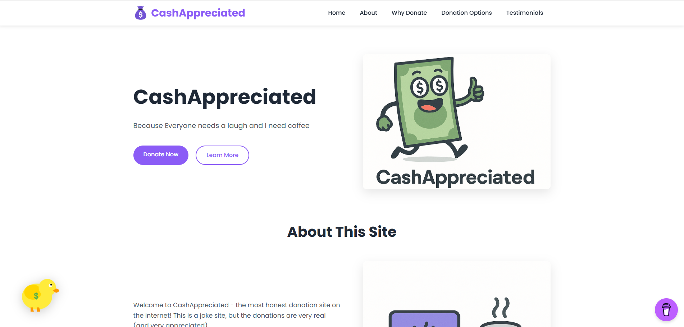
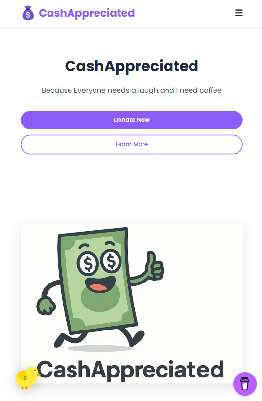
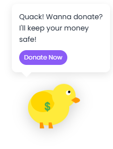
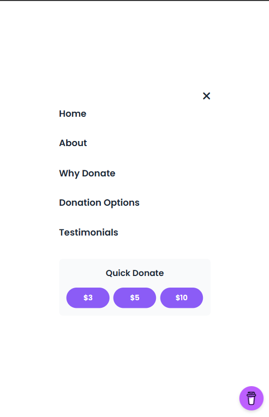

# CashAppreciated - Lab 3: Responsive Design & Animations

## Project Overview

This repository contains the Lab 3 implementation for Web Development course, building upon the "CashAppreciated" donation landing page created in Lab 2. The focus of this lab was implementing responsive design and adding animated elements to enhance user experience across all device sizes.

## Live Demo

Visit the site here: [https://lab3.cashappreciated.com/](https://lab3.cashappreciated.com/)

## Lab 3 Requirements Fulfilled

### Responsive Design

✅ **Responsive Layout**: All elements adjust size appropriately for desktop and mobile viewing.
- Implemented media queries for breakpoints at 1200px, 992px, 768px, and 576px
- Created flexible grid layouts that reorganize for smaller screens
- Adjusted font sizes, spacing, and containers for different device widths

✅ **Mobile-Visible Call-to-Action**:
- CTAs remain prominently visible and accessible on mobile devices
- Donation buttons expand to full width on smaller screens for easier tapping

✅ **Mobile-Only Elements**:
- Added a dedicated mobile navigation menu that slides in from the side
- Created a "Quick Donation Tips" section that only appears on mobile devices
- Implemented mobile-specific quick donation buttons in the mobile menu
- Mobile menu automatically closes when a section is selected

### Mascot Implementation

✅ **Theme-Related Mascot**:
- Designed a money duck mascot with dollar signs to match the donation theme
- The duck represents both the playful nature of the site and its financial purpose

✅ **Visual Appeal**:
- Created a colorful, friendly SVG duck with clean lines and cheerful appearance
- Used bright colors consistent with the site's color scheme

✅ **Delayed Appearance**:
- Mascot appears after a 2-second delay
- Gradual fade-in animation when appearing

✅ **Positioning**:
- Mascot appears in the bottom-left corner of the viewport
- Designed to be visible but not intrusive to the main content

✅ **Animations**:
- Implemented multiple coordinated animations:
  - Gentle floating motion for the entire duck
  - Head bobbing animation
  - Wing flapping
  - Leg kicking movement
  - All animations use different timing to create natural movement

✅ **Interactive Message**:
- Message bubble appears when hovering/tapping the duck
- Contains a call-to-action encouraging donations
- Styled to match the site's visual language

## Key Features

1. **Fully Responsive Design**:
   - The site adapts seamlessly from desktop to mobile
   - Content reflows and resizes based on screen width
   - Touch-friendly elements on mobile

2. **Animated Money Duck Mascot**:
   - Custom SVG mascot with multiple animated parts
   - Interactive hover/tap effects
   - Timed appearance for better user experience

3. **Enhanced Mobile Experience**:
   - Mobile-optimized menu
   - Special mobile-only sections
   - Vertically stacked donation options for easier browsing

4. **Performance Optimized**:
   - Pure CSS animations requiring no JavaScript
   - Lightweight SVG graphics
   - Minimal impact on page load time

5. **Buy Me a Coffee Integration**:
   - Floating widget for easy access
   - Complements the site's donation theme

## Technologies Used

- HTML5
- CSS3 (Vanilla CSS with no frameworks)
- JavaScript (minimal, only for interactions)
- SVG for mascot implementation
- CSS Animations and Transitions
- Media Queries for responsive design

## Implementation Challenges

- **Coordinating Mascot Animations**: Creating natural-looking movement by synchronizing multiple animations with different timing and properties.
- **Responsive Card Layout**: Ensuring donation option cards stack properly on mobile while maintaining the featured card prominence.
- **Mobile Menu UX**: Implementing an intuitive mobile menu that closes automatically when a section is selected.

## Development Process

1. Enhanced the existing Lab 2 landing page with responsive design principles
2. Created and refined the money duck mascot SVG with multiple animated parts
3. Developed mobile-specific layouts and elements
4. Implemented animations and transitions
5. Tested across multiple device sizes and refined the implementation

## Screenshots

  

    
    
<em>Desktop View</em>

  

  

    
    
<em>Mobile View</em>

  

  

    
    
<em>Duck Mascot with Message</em>

  

  

    
    
<em>Mobile Menu</em>

  

## How to Run Locally

1. Clone this repository
2. Open `index.html` in your browser
3. Resize the browser window to see responsive behavior
4. Wait a few seconds for the duck mascot to appear
5. Hover/click on the mascot to see the message

## Future Improvements

- Add dark mode toggle as mentioned in Lab 2
- Enhance animations with scroll-triggered effects
- Implement a "mascot follows scroll" behavior
- Create additional interactive elements

---

Created by Negai Marin for Web Development Lab 3 | Technical University of Moldova